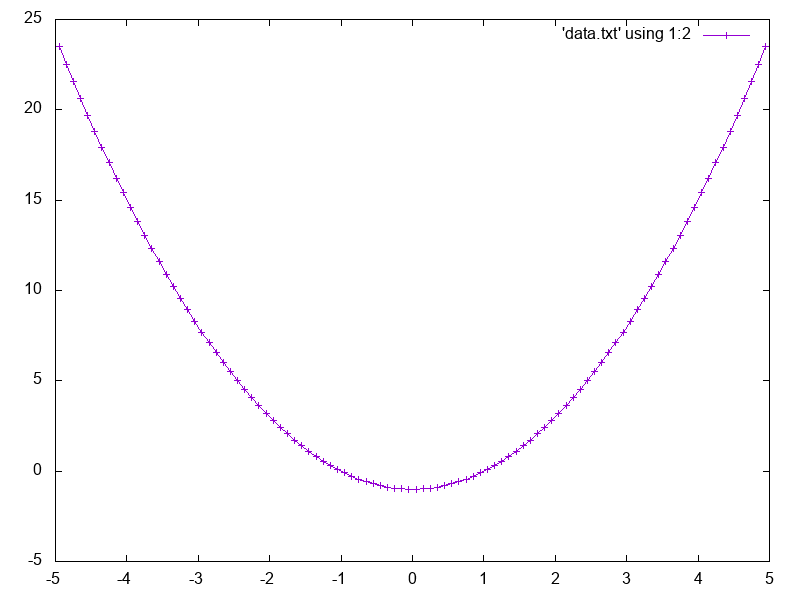

A gnuplot wrapper for Lua

Example:

``` Lua
local x, y = {}, {}

for i=1,100 do
	local xi = (i-.5)/100 * 10 - 5
	table.insert(x,xi)
	local yi = xi^2 - 1
	table.insert(y,yi)
end

local gnuplot = require 'gnuplot'
gnuplot{
	output = 'out.png',
	data = {x,y},
	style = 'data linespoints',
	{using='1:2'},
}
```

...produces...


