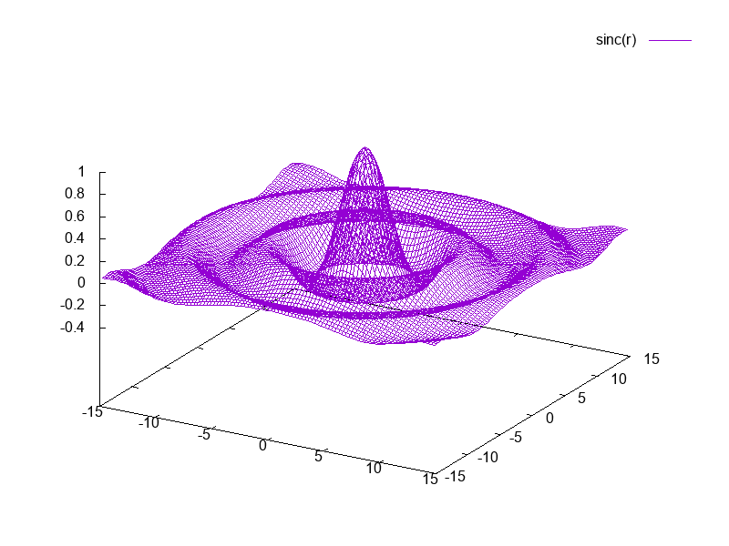

A gnuplot wrapper for Lua.

### Installing:

Use the luarocks rockspec, or modify the path as described in my lua-ext project (listed in 'dependencies').

### Dependencies:

- https://github.com/thenumbernine/lua-ext

### Examples:

``` Lua
require 'gnuplot'{
	persist = true,
	{'x**2'},	
}
```

...produces a window containing...


``` Lua
local x, y = {}, {}

for i=1,100 do
	local xi = (i-.5)/100 * 10 - 5
	table.insert(x,xi)
	local yi = xi^2 - 1
	table.insert(y,yi)
end

local gnuplot = require 'gnuplot'
gnuplot{
	output = 'example2.png',
	data = {x,y},
	style = 'data linespoints',
	{using='1:2'},
}
```

...produces...


``` Lua
local x, y = {}, {}
for i=1,100 do
	local xi = (i-.5)/100 * 30 - 15
	table.insert(x,xi)
	local yi = (i-.5)/100 * 30 - 15
	table.insert(y,yi)
end
local z = {}
for i,xi in ipairs(x) do
	z[i] = {}
	for j,yi in ipairs(y) do
		local r = math.sqrt(xi^2 + yi^2)
		z[i][j] = math.sin(r) / r
	end
end

local gnuplot = require 'gnuplot'
gnuplot{
	output = 'example3.png',
	griddata = {x=x,y=y,z},
	style = 'data lines',
	{splot=true, using='1:2:3', title='sinc(r)'},
}
```

...produces...


